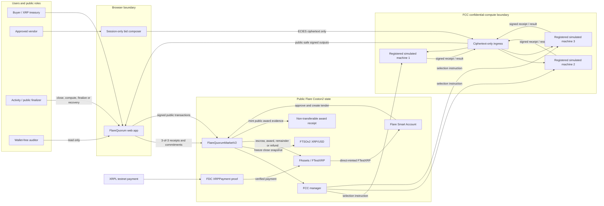
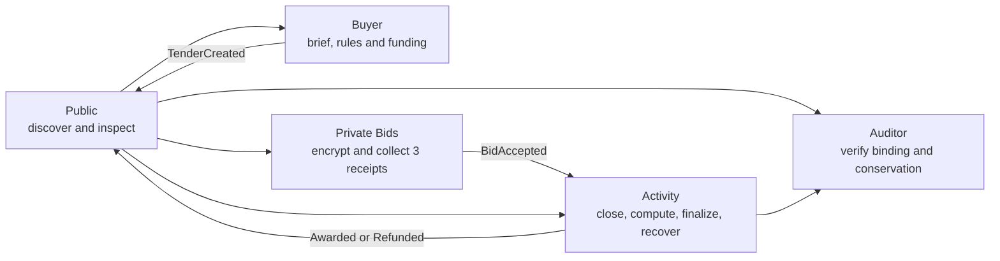
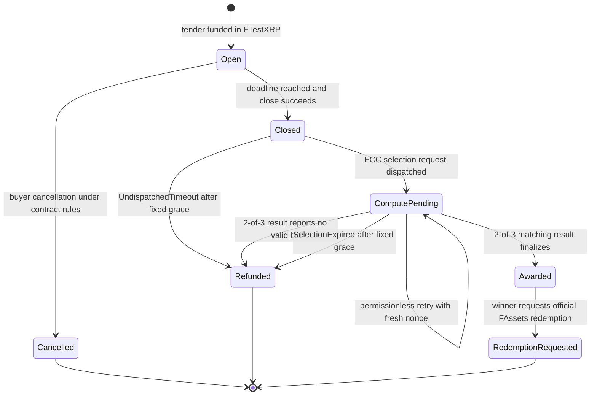

# FlareQuorum

> Confidential procurement for XRP and Flare treasuries, powered by Flare
> Confidential Compute.

[LIVE COSTON2 APP](https://flare-quorum.vercel.app) ·
[WALLET-FREE AUDITOR](https://flare-quorum.vercel.app/flare?role=evidence) ·
[JUDGE PACKAGE](submission/flarequorum/README.md) ·
[VERIFIED MANIFEST](packages/flare-contracts/deployments/coston2.release.json) ·
[NEW-WORK LEDGER](submission/flarequorum/NEW-WORK-LEDGER.md)

## Summer Signal submission

| Submission field | FlareQuorum |
|---|---|
| Project | **FlareQuorum** |
| Selected bounties | **Confidential Compute Apps** and **Interoperable Asset Products** |
| Target users | XRP-native treasury operators, Flare DAOs/procurement teams, and vendors protecting commercial offers |
| Working demo | [flare-quorum.vercel.app](https://flare-quorum.vercel.app) on Flare Testnet Coston2 (`114`) |
| Primary outcome | A public, independently inspectable procurement award without publishing losing bids |
| Release status | Verified Coston2 V2; three simulated FCC machines, 3-of-3 bid custody, and 2-of-3 result agreement |

- **Primary bounty:** Confidential Compute Apps.
- **Secondary selected bounty:** Interoperable Asset Products.

FlareQuorum lets a treasury publish transparent procurement rules and escrow
FTestXRP while approved vendors submit encrypted multi-criteria offers to three
registered simulated FCC machines. Flare Confidential Compute performs
qualification, eligibility, comparison, and winner selection. The market
settles only after two tender-fixed machines sign the same deterministic result.

The product is useful where public offers leak vendor strategy but a private
server would give the operator too much authority. Buyers get transparent
rules and escrow; vendors keep losing commercial terms private; auditors can
verify the rule/result/settlement binding without a wallet or decryption key.

## Quick start

The checked-in public configuration targets the verified Coston2 V2 release.
From a fresh clone:

```bash
git clone https://github.com/huutrungle2001/flare-quorum.git
cd flare-quorum
nvm use
corepack enable
corepack pnpm install --frozen-lockfile
cp .env.example .env.local
corepack pnpm --filter @flarequorum/tender-room dev --host 0.0.0.0
```

Open <http://localhost:5173> or <http://localhost:5173/flare>. The wallet-free
Public and Auditor workspaces require these four public release values:

```dotenv
VITE_COSTON2_RPC_URL=https://coston2-api.flare.network/ext/C/rpc
VITE_FLARE_MARKET_ADDRESS=0xE1252D445ee86ED78C1da2bD5f1bF4a69bF476AC
VITE_FLARE_MARKET_DEPLOYMENT_BLOCK=33919464
VITE_FLARE_DEPLOYMENT_STATUS=verified
```

The Buyer Brief, encrypted bid ingress, and FCC lifecycle actions additionally
use the public `VITE_FLARE_INGRESS_URL` and
`VITE_FLARE_FCC_INSTRUCTION_FEE_WEI` values already present in
[`.env.example`](.env.example). No private key, XRPL seed, FCC credential, or
provider token belongs in browser configuration. Missing or inconsistent
Coston2 configuration fails closed; the app never substitutes Sepolia or mock
state.

## Judge in two minutes

1. Open the [Public workspace](https://flare-quorum.vercel.app) and inspect a
   finalized Coston2 tender without connecting a wallet.
2. Open [Auditor](https://flare-quorum.vercel.app/flare?role=evidence) and check
   the rule hash, ordered bid root, FCC machine set, FTSO snapshot, matching
   result signers, and escrow conservation.
3. Open [Buyer](https://flare-quorum.vercel.app/flare?role=buyer) to inspect
   direct FTestXRP funding and the XRP/FDC/Smart Account funding path.
4. Open [Private Bids](https://flare-quorum.vercel.app/flare?role=vendor) to see
   the approved-wallet gate and encrypted three-receipt submission path.
5. Use the [judge package](submission/flarequorum/README.md) for addresses,
   evidence, new-work disclosure, limitations, and reproduction commands.

> [!IMPORTANT]
> **Current release boundary:** Phase 0 feasibility validation is complete.
> `FlareQuorumMarketV2` is the verified, consumer-selected Coston2 release, and
> Gates 0–H pass for the recorded technical and bounded owner-operated
> website-acceptance scope. V1 and Sepolia/Nox are historical evidence only.
> Independent interviews, pilots, adoption, and traction are not claimed.

> [!WARNING]
> This repository contains unaudited hackathon software. Use disposable testnet
> wallets and assets only. The FCC machines are simulated rather than hardware-
> backed production TEEs; this is not a mainnet, formal-audit, or production-
> security claim.

## Why FlareQuorum

Public procurement leaks commercial information. A vendor that can see earlier
offers may copy, undercut, or coordinate around them. A private server hides the
offers but gives buyers and vendors weak assurance that the published winner
was actually produced by the agreed rule.

FlareQuorum combines:

- Public tender rules, deadlines, vendor admission, escrow, and lifecycle.
- Private ECIES bid ingress with no permanent on-chain ciphertext.
- Threshold TEE-signed bid receipts and a public ordered commitment root.
- Deterministic private credential, price, delivery, and warranty scoring.
- A signed result bound to the chain, market, tender, bid root, rule hash, close
  checkpoint, and replay nonce.
- On-chain verification and permissionless finalization.
- FTSO-bound XRP/USD normalization and public FTestXRP settlement on Coston2.
- XRP-native mint-and-fund through Flare Smart Accounts and FDC.
- Official FAssets amount-based redemption-request path; underlying XRP payout
  remains an external agent obligation.
- A public evidence trail without plaintext losing bids or private credentials.

## System architecture

FCC is inside the winner-selection and settlement path. The browser, buyer,
ingress service, finalizer, and auditor cannot provide or override a winner.



| Boundary | What crosses it |
|---|---|
| Browser → ingress | ECIES ciphertext addressed to each frozen machine; no plaintext bid field |
| FCC machines → browser | Signed bid receipts, signed rejection codes, and matching public result envelopes |
| Browser → market | Public tender rules, salted commitments, receipt signatures, lifecycle calls, and threshold results |
| Market → public | Tender state, ordered bid root, FTSO checkpoint, result binding, winner, and FTestXRP settlement |
| Never public | Losing price/delivery/warranty terms, private credentials, bid ciphertext, salts, and TEE keys |

See [Architecture](docs/architecture.md),
[Contract Specification](docs/contract-spec.md), and
[Threat Model](docs/threat-model.md) for the full trust and protocol model.

## Website journey

The website is organized around five workspaces that read the same canonical
Coston2 market state. Successful writes trigger a coordinated refresh across
Public, Activity, Private Bids, Buyer, and Auditor; a confirmed transaction
remains visible while the public reader reaches finality, and finalized chain
state remains authoritative after reload.



| Workspace | Primary journey | Wallet requirement | Confidential access |
|---|---|---|---|
| Public | Discover tenders, read the hash-verified Buyer Brief, rules, status, and public award | None | None |
| Buyer | Compose the public brief, choose direct FTestXRP or XRP/FDC/Smart Account funding, and create the tender | Buyer wallet for writes | None |
| Private Bids | Verify admission and frozen machine policy, encrypt a session-only bid, collect all three receipts, and submit the public commitment | Approved vendor wallet | Own unsent plaintext in current browser memory only |
| Activity | Execute the currently valid close, FCC compute, finalize, cancel, or refund action; successful actions become disabled | Depends on canonical action; close/compute/finalize are permissionless, refunds remain buyer-only | None |
| Auditor | Inspect rule hash, ordered root, signer quorum, FTSO snapshot, result digest, and escrow conservation | None | None; no decryption or spending authority |

## Tender lifecycle



`RedemptionRequested` is an external FAssets boundary, not a
FlareQuorum-market state and not proof of instant native XRP payout. Neither
refund path invents a winner or represents FCC failure as successful compute.

## Privacy boundary

Private by design:

- Losing bid prices, commercial terms, credentials, and encrypted payloads.
- Vendor qualification inputs submitted for confidential scoring.
- Intermediate eligibility, normalization, and comparison results.
- TEE decryption keys and plaintext working state.

Public by design:

- Tender metadata, buyer, approved vendor addresses, deadline, rule hash, and
  public ceiling.
- Bidder participation, salted commitments, TEE receipt signatures, timing, and
  transaction hashes.
- TEE extension identity, code/version identifiers, signed result envelope, and
  lifecycle evidence.
- Winner and winning FTestXRP settlement amount on Coston2.

The initial Flare edition does **not** claim confidential ERC-20 settlement.
Ordinary token transfers disclose their amount. A future TEE-backed private
accounting layer is research scope and must not be described as shipped.

## Meaningful Flare integration

| Flare capability | Product role | Delivery status |
|---|---|---|
| Flare Confidential Compute | Private bid intake, sealed state, multi-criteria scoring, and threshold-signed result | Live core lifecycle and supported three-machine replacement recovery passed |
| Coston2 smart contracts | Canonical tender, escrow, result verification, and settlement state | Verified release manifest and live deployment consistency evidence |
| FAssets / FTestXRP | XRP-backed test-asset mint, tender escrow, vendor payout, and redemption request | Live FTestXRP escrow/direct mint and official redemption-request boundary passed; the underlying agent payout remains an external FAssets obligation |
| Flare Data Connector | Prove the XRPL payment that authorizes Smart Account mint-and-fund | Live `XRPPayment` proof recorded in Gate G evidence |
| FTSOv2 | Freeze XRP/USD close snapshot for XRP/USD bid normalization | Live close snapshot is bound to the FCC result and settlement |
| Flare Smart Accounts | Atomically direct-mint FTestXRP and create/fund a tender from an XRPL instruction | Live `0xFE` direct-mint-and-fund lifecycle passed |
| Multi-TEE threshold | Fixed three-machine bid custody and two matching selection results | Live three-bid common quorum, two-signature result, one-result outage, and rolling replacement passed; simultaneous two-machine loss remains fail-closed |

Every integration must be exercised by the single flagship product journey and
recorded in evidence.
Displaying a feed, accepting an arbitrary token, or merely changing RPC does not
count as a completed integration.

## Existing project disclosure and new work

| Category | Summer Signal boundary | Why it matters |
|---|---|---|
| Existed before | Historical Sepolia/Nox confidential procurement, Safe funding, relay, web app, bindings, and evidence | Preserves provenance without presenting old Ethereum work as Flare work |
| Newly built | FCC Go extension, private ECIES ingress, three-machine receipt quorum, Flare market/contracts, and Coston2 bindings | Makes FCC responsible for private eligibility, comparison, and selection |
| Ported | Public explorer, role-based product shell, and stateless checkpoint recovery | Gives judges and users a usable Flare-native workflow |
| Integrated | FAssets/FTestXRP, FDC `XRPPayment`, FTSOv2, and Flare Smart Accounts | Connects XRP-native funding, price normalization, escrow, payout, and redemption |
| Improved | Multi-criteria scoring, 3-of-3 bid custody, 2-of-3 result agreement, replay domains, bounded refunds, and replacement recovery | Reduces winner authority and makes failure states explicit and recoverable |

### Why the new work is meaningful

This is not an RPC switch or a visual port. The Summer Signal work changes who
holds procurement authority. In the historical product, the compute,
settlement, and interoperability assumptions belonged to a different network
and confidential-compute stack. In FlareQuorum, a registered FCC machine set
now receives the private inputs, applies the frozen qualification and scoring
policy, and produces the only result the Coston2 market can settle. The buyer,
web application, relay, finalizer, and administrator cannot submit a preferred
winner or bypass the threshold.

| Audience | Previous constraint | Meaningful outcome from the new Flare work |
|---|---|---|
| Treasury buyers | Public bidding exposes commercial strategy; a private server hides bids but leaves the operator able to influence selection | Buyers freeze the brief, admission list, ceiling, service bounds, weights, machine set, and escrow before bidding. Settlement requires a result bound to those exact facts, and fixed timeout paths return the full escrow without inventing a winner when FCC cannot complete |
| Vendors | Losing price, delivery, warranty, and qualification terms are normally disclosed to the buyer, competitors, or a centralized procurement operator | Vendors encrypt one canonical offer to all three tender-fixed machines. Of the offer content, only a salted commitment and signed receipts become public; participation and timing remain public by design, but the buyer, finalizer, and Auditor receive no decryption capability. The vendor still gets proof that the accepted commitment entered the common ordered root |
| Auditors and governance teams | A published winner is difficult to distinguish from a database decision or client-calculated result | A wallet-free reviewer can independently inspect the frozen rule hash, approved machine identities and code binding, 3-of-3 receipt custody, ordered bid root, FTSO checkpoint, two matching result signers, and exact FTestXRP conservation without accessing a bid payload |
| Flare and XRP developers | Building one credible cross-chain confidential application requires coordinating external-payment proof, account execution, asset minting, oracle snapshots, private compute, generated bindings, retries, and evidence | The repository provides a complete, domain-separated implementation pattern across Solidity, Go, and TypeScript: XRPL Payment → FDC proof → Smart Account direct mint/funding → FCC selection → FTestXRP settlement → FAssets redemption request, including failure and recovery semantics rather than only happy-path calls |
| Flare ecosystem | Protocol integrations are often demonstrated independently, leaving unclear whether any one of them is necessary to the product | FCC, FDC, Smart Accounts, FAssets, and FTSOv2 are exercised by one procurement lifecycle. FCC removes operator winner authority; FDC and Smart Accounts create the XRP-native funding path; FAssets supplies the escrowed asset and exit boundary; FTSOv2 fixes the conversion fact used by private scoring. Removing any of these breaks a demonstrated user capability rather than a marketing checklist |

The user-level gain is therefore not merely “bids are encrypted.” Treasuries
gain a bounded, publicly accountable purchasing process; vendors gain
confidentiality for losing commercial terms; auditors gain verification without
custody or decryption; and developers gain a reproducible architecture for
combining public cross-chain facts with private deterministic decisions. For
Flare, the release demonstrates that confidential compute can drive an actual
asset-settlement decision while the wider protocol stack supplies funding,
pricing, recovery, and public evidence.

The detailed, evidence-backed mapping is in the
[new-work ledger](submission/flarequorum/NEW-WORK-LEDGER.md).

FlareQuorum is the current product and repository brand. Existing `VeilBid*`
Solidity identifiers, image tags, and verified deployment artifacts retain
their historical names so a rebrand never rewrites source or on-chain evidence.

The historical predecessor previously shipped a verified Ethereum Sepolia release for the iExec
Nox hackathon. That baseline includes Safe treasury funding, Nox encrypted
argmin selection, ERC-7984 confidential settlement, a web application, a
stateless relay, generated bindings, and sanitized evidence.

The historical release remains reproducible at:

- `packages/contracts/deployments/sepolia.release.json`
- `packages/chain-bindings/generated/`
- `evidence/sepolia/`

Those artifacts are **pre-hackathon baseline evidence**, not proof of Flare
integration. The new work ledger and Coston2 evidence must identify everything
built, ported, or improved for Summer Signal.

## Repository structure

```text
apps/
  web/                 # shared product UI, migrated to Coston2
  relay/               # permissionless close/result/finalize automation
  console/             # read-only public inspection tools
  fcc-extension/       # new TEE extension and proxy integration
packages/
  flare-contracts/     # new Coston2/Flare contracts and tests
  flare-bindings/      # generated Flare ABI/address/event bindings
  contracts/           # retained Sepolia/Nox baseline
  chain-bindings/      # retained Sepolia/Nox baseline bindings
evidence/
  coston2/             # new sanitized Flare evidence
  sepolia/             # historical pre-hackathon evidence
docs/
```

See the [Championship Plan](PLAN.md),
[Architecture Decisions](docs/architecture-decisions.md),
[Product Plan](docs/product-plan.md),
[Feasibility Plan](docs/feasibility-plan.md), and
[Verification Plan](docs/verification.md).

## Verified deployment and evidence

| Release fact | Verified value |
|---|---|
| Network | Flare Testnet Coston2, chain `114` |
| Market | [`0xE125…76AC`](https://coston2-explorer.flare.network/address/0xE1252D445ee86ED78C1da2bD5f1bF4a69bF476AC), deployed at block `33919464` |
| Award receipt | [`0xA024…4Ac3`](https://coston2-explorer.flare.network/address/0xA0249F4204503dcB9FE3A3153d7D48936E7a4Ac3) |
| FTestXRP | [`0x0b6A…3dc7`](https://coston2-explorer.flare.network/address/0x0b6A3645c240605887a5532109323A3E12273dc7) |
| FCC manager | [`0x1a9C…18aE`](https://coston2-explorer.flare.network/address/0x1a9C4A0f9D76c0b1D91d22E24E573a9b377618aE) |
| FCC binding | Extension `66142`, version `v0.2.2`, code hash `0x194844cf417dde867073e5ab7199fa4d21fd82b5dbe2bdea8b3d7fc18d10fdc2` |
| Quorum | Three registered simulated machines; 3-of-3 bid custody; 2-of-3 result agreement |
| Release authority | [`coston2.release.json`](packages/flare-contracts/deployments/coston2.release.json) |

High-signal sanitized evidence:

- [Three-vendor private selection and award](evidence/coston2/market-v2-refresh-multi-vendor-success.json).
- [One result endpoint unavailable while two frozen machines finalize](evidence/coston2/market-v2-refresh-one-result-outage.json).
- [Invalid private credential rejected by all three machines, then corrected](evidence/coston2/market-v2-refresh-invalid-credential.json).
- [XRPL Payment, FDC proof, Smart Account direct mint, and atomic tender funding](evidence/coston2/gate-g-smart-account.json).
- [Official amount-based FAssets redemption request](evidence/coston2/fassets-redemption.release.json).
- [Pre-dispatch](evidence/coston2/market-v2-undispatched-refund.json) and
  [post-dispatch](evidence/coston2/market-v2-selection-expired-refund.json)
  bounded full-refund paths.
- [V2 deployment consistency](evidence/coston2/market-v2-deployment-consistency.json),
  [hosted web smoke](evidence/coston2/web-v2-production-smoke.json), and
  [owner-operated website acceptance](evidence/coston2/website-acceptance.release.json).

The preserved
[`coston2.v1.release.json`](packages/flare-contracts/deployments/coston2.v1.release.json)
is historical rollback evidence, not consumer authority.

## Short roadmap

1. Run external buyer/vendor usability sessions and pursue one honest Coston2
   design-partner pilot; do not claim traction before those sessions occur.
2. Expand browser-native XRP recovery, wallet coverage, and live fault drills
   while preserving fail-closed behavior.
3. Move from simulated FCC machines to a hardware-backed, audited operating
   model before any production-value deployment.
4. Validate mainnet FXRP funding/redemption and evolve the proven procurement
   flow into milestone-based treasury execution without changing historical
   release claims.

See [PLAN.md](PLAN.md) for acceptance criteria and sequencing.

## Validation

```bash
corepack pnpm test
corepack pnpm lint
corepack pnpm build
corepack pnpm evidence:validate
corepack pnpm flare:judge:check
```

Live Coston2 write harnesses require explicit operator configuration and are
not needed to inspect the checked-in public evidence. See
[Verification](docs/verification.md), [Security Policy](SECURITY.md), and the
[MIT License](LICENSE).

## Documentation

- [Summer Signal Judge Package](submission/flarequorum/README.md)
- [New-Work Ledger](submission/flarequorum/NEW-WORK-LEDGER.md)
- [Privacy and Trust Explanation](submission/flarequorum/PRIVACY-TRUST-TALK.md)
- [Original Source Materials](docs/original/README.md)
- [Competition Requirements and Judging Map](docs/hackathon-brief.md)
- [FCC Coston2 Operational Baseline](docs/fcc-coston2-operations.md)
- [User Guide](docs/user-guide.md)
- [Championship Execution Plan](PLAN.md)
- [Architecture Decisions](docs/architecture-decisions.md)
- [Product Plan](docs/product-plan.md)
- [Feasibility Plan](docs/feasibility-plan.md)
- [Architecture](docs/architecture.md)
- [Contract Specification](docs/contract-spec.md)
- [Threat Model](docs/threat-model.md)
- [Deployment](docs/deployment.md)
- [Verification](docs/verification.md)
- [Security Policy](SECURITY.md)
