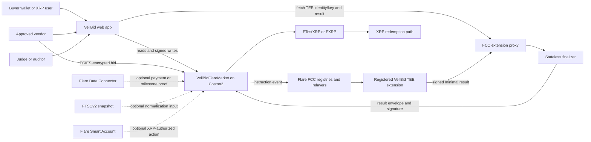
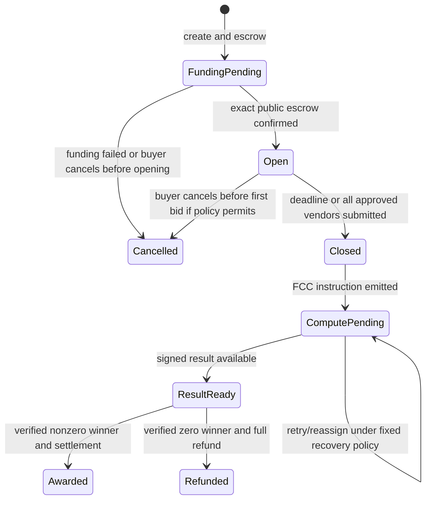

# VeilBid Flare Architecture

> Status: Target architecture. No canonical Coston2 deployment exists yet.

## 1. Goals

- Make Flare Confidential Compute essential to winner selection.
- Keep canonical tender, escrow, and terminal state on Flare.
- Keep vendor plaintext inside the attested TEE boundary only.
- Verify a minimal signed result on-chain with complete domain binding.
- Make asynchronous request/result/finalization recoverable.
- Add FAssets, FDC, FTSO, and Smart Accounts only through meaningful product
  journeys.
- Preserve the verified Sepolia/Nox release as an isolated historical baseline.

## 2. System context



## 3. Trust and execution boundary

### Flare contract

Canonical for:

- tender identity, public rules, vendor admission, deadline, and status;
- ordered bid commitments and frozen bid root;
- escrow balances and terminal settlement;
- configured FCC extension, allowed code version, and signer policy;
- result nonce/expiry/replay checks;
- public winner, amount, receipt, and evidence events.

The contract never decrypts or calculates a bid and never accepts a winner
without a verified FCC result envelope.

### FCC infrastructure and TEE extension

Responsible for:

- receiving adequately authorized instructions through the FCC path;
- decrypting the ECIES bid packages inside the TEE;
- verifying canonical encoding, binding, nonce, and commitment;
- executing deterministic eligibility and selection;
- signing the minimum result envelope;
- returning no losing bid values or private credentials.

FCC relayers, proxy, registered TEE identity, code-version governance, machine
attestation, and the extension implementation are inside the correctness,
confidentiality, and availability boundary.

### Browser

Responsible for:

- showing exactly which fields are public or private;
- validating the selected chain, contract, extension, and TEE key;
- canonical bid encoding and client-side ECIES encryption;
- submitting ciphertext only;
- clearing plaintext on account/network change and never persisting it.

A compromised browser can observe data before encryption.

## 4. On-chain components

### `VeilBidFlareMarket`

- Creates and funds tenders.
- Stores one to eight unique approved vendors.
- Accepts one immutable ciphertext commitment per approved vendor.
- Maintains an ordered bid root from public commitments.
- Closes after the deadline or all vendor slots submit.
- Emits an FCC instruction bound to frozen public state.
- Verifies result signature, signer registration/policy, domain, rule hash, bid
  root, close checkpoint, nonce, expiry, winner slot, and amount bounds.
- Pays the public winning amount and public remainder, or refunds full escrow
  for a zero winner.
- Mints one non-transferable award receipt.

### `VeilBidFlareAwardReceipt`

- Immutable, non-transferable ERC-721-style public award record.
- Mints only after successful FCC result verification and settlement.
- Contains tender, buyer, winner, asset, result digest, and finalized block/time.
- Contains no losing bid or private qualification data.

### Optional `VeilBidMilestoneEscrow`

Introduced only after the core market is verified. It releases a predefined
tranche after a supported FDC proof is checked and bound to one tender,
milestone, source, recipient, amount, and nonce. It does not parse arbitrary
untrusted API output.

## 5. Encrypted bid protocol

Canonical plaintext schema inside the browser and TEE:

```text
version
chainId
market
extensionId
tenderId
vendor
submissionNonce
rulesHash
price
optional fixed-schema scoring fields
salt
```

Submission flow:

1. Client verifies Coston2, market address, extension ID, approved code version,
   TEE identity, and encryption public key.
2. Client encodes the exact schema and computes its local commitment.
3. Client ECIES-encrypts the canonical bytes to the intended TEE key.
4. Contract records vendor, ciphertext commitment, ordering, and submission
   checkpoint; events must not emit plaintext.
5. At close, the contract freezes the ordered root and emits the selection
   instruction.
6. The TEE decrypts, checks each plaintext against its public commitment and
   binding, then applies the deterministic rule.

The storage location for full ciphertext bytes is selected during Gate B. If
on-chain, cost limits are explicit. If content-addressed off-chain storage is
used, the chain commitment and immutable availability/retrieval policy become
part of the signed result and threat model.

## 6. Selection and signed result

Tier-1 rule:

```text
valid = price > 0 && price <= publicCeiling
winner = earliest submitted bid with the lowest valid price
```

Result schema:

```text
version
chainId
market
extensionId
codeVersion
tenderId
rulesHash
orderedBidRoot
closeBlock
winnerBidId
winner
winningAmount
resultNonce
expiry
```

The TEE signs a domain-separated digest. The market reconstructs the digest and
checks every public field. A caller supplies transport data, not a decision.

## 7. Lifecycle



No timeout path may let the buyer recover funds after bids are frozen if doing
so can invalidate a legitimate result. Recovery may recompute the same fixed
input under the approved signer/code policy.

## 8. Flare protocol roles

### FAssets

FTestXRP/FXRP is the intended interoperable settlement asset. Address discovery,
mint/fund, escrow, payout, and redemption behavior must use supported Flare
interfaces. Ordinary transfer amounts remain public.

### FDC

Optional proof layer for an external XRP payment or defined delivery/milestone
signal. The contract verifies the supported attestation proof and binds its
decoded fields to a predetermined action.

### FTSOv2

Optional public snapshot for fixed-point conversion when the shipped tender
supports multiple quote units. Feed ID, value, decimals, and timestamp are
captured in public tender/close state and included in `rulesHash` or the signed
result binding.

### Flare Smart Accounts

Optional XRP-native control path. It must use a supported XRPL-authorized
instruction, prevent replay, and preserve the same market validation as an EVM
wallet call.

## 9. Off-chain applications

### Web

- Wallet-free public explorer and evidence route.
- Buyer funding/create and vendor encrypted submission.
- FCC identity/key/status display.
- Close, compute-request, signed-result, and finalize progress.
- Explicit public/private labels and no fabricated success states.

### Relay

- Stateless public readiness discovery.
- Close/request/result/finalize only.
- Simulation and canonical reread before writes.
- No bid key, plaintext, or subjective winner path.

### Console

- Read-only public tender, FCC, result, settlement, and evidence inspection.
- No signer, bid decryption, raw sensitive proxy response, or custody.

## 10. Failure and recovery

- RPC failure: show unavailable state.
- TEE key/identity mismatch: block encryption and submission.
- Proxy/indexer delay: bounded pending/retry state.
- TEE unavailable: apply the fixed approved-machine recovery policy to the same
  bid root and rule hash.
- Result expired: request recomputation; never reopen or reorder bids.
- Invalid signature/binding: reject and preserve recoverable closed state.
- Competing finalizer: reread and classify as benign only if canonical state has
  already advanced correctly.
- FDC/FTSO/Smart Account outage: pause only the dependent optional flow; never
  substitute user-supplied proof or price.

## 11. Historical isolation

`packages/contracts`, `packages/chain-bindings`, and `evidence/sepolia` remain
the Nox/Sepolia baseline. The Flare edition uses separate contract, binding,
deployment, and evidence authorities so that no historical address or proof is
mistaken for Summer Signal work.
