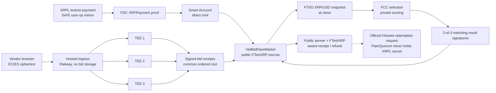

# FlareQuorum — Judge Package

This folder is the Summer Signal submission material for the verified,
consumer-selected Flare Coston2 V2 market release and its judge application.
The files in the parent `submission/` folder describe the historical
Ethereum Sepolia/Nox release and must not be used as evidence for this package.

The side-by-side `FlareQuorumMarketV2` deployment passed its promotion,
refund, recovery, credential-negative, and refreshed machine gates before the
consumer switch. Gate H user validation is still recorded separately as
`NOT_RUN`; no interview, usability, pilot, or traction outcome is inferred.

## Start here

| Resource | Link |
| --- | --- |
| Live app | [flare-quorum.vercel.app](https://flare-quorum.vercel.app) |
| Four-minute demo | [`flare-quorum-demo.mp4`](flare-quorum-demo.mp4) |
| Demo evidence | [`judge-demo-video.release.json`](../../evidence/coston2/judge-demo-video.release.json) |
| Public evidence ledger | [Coston2 Activity/Evidence view](https://flare-quorum.vercel.app/flare?role=evidence) |
| Buyer workspace | [Coston2 Buyer](https://flare-quorum.vercel.app/flare?role=buyer) |
| Vendor workspace | [Coston2 Vendor](https://flare-quorum.vercel.app/flare?role=vendor) |
| Technical docs | [Flare docs](https://flare-quorum.vercel.app/docs#flare-coston2) |
| Integration guide | [`docs/integration-guide.md`](../../docs/integration-guide.md) |
| Validation protocol | [`VALIDATION-PLAN.md`](VALIDATION-PLAN.md) |
| Community draft | [`COMMUNITY-UPDATE.md`](COMMUNITY-UPDATE.md) |
| Source | [github.com/huutrungle2001/flare-quorum](https://github.com/huutrungle2001/flare-quorum) |
| Hosted ingress health | [Railway `/health`](https://veilbid-flare-ingress-production.up.railway.app/health) |

The app and ingress use Coston2 chain ID `114` and test assets only. A wallet is
not needed to inspect the finalized public state. Buyer/vendor writes require
an explicit Coston2 wallet connection; no private key, XRPL secret, TEE key, or
proxy credential is requested by the browser.

## One-line submission copy

> FlareQuorum lets XRP treasuries fund public procurement rules from Flare Coston2,
> while three registered FCC TEEs privately score encrypted vendor offers and
> the market accepts only a matching threshold result before paying the winner
> in FTestXRP.

## Selected bounty

- **Primary:** Confidential Compute Apps.
- **Interoperable Asset Products:** a credible secondary fit only where the
  judge follows the recorded XRPL → FDC `XRPPayment` → Smart Account direct
  mint → FTestXRP tender journey, then the winning Coston2 wallet can submit an
  official amount-based FAssets redemption request. The agent's later XRPL
  payment remains protocol-governed; FlareQuorum never holds an XRPL secret.

FCC is essential: the winner is computed from sealed bid state inside the
  registered extension, not supplied by the browser, buyer, or relay. FTSO is
  essential for the close-time XRP/USD snapshot. FDC and Smart Accounts are
  essential for the XRP-native funding path. FAssets are the official asset
  boundary and redemption route; FlareQuorum never receives an XRPL secret.

## Judge route (no wallet)

1. Open the [public dossier](https://flare-quorum.vercel.app/).
2. Read the verified FCC manager, extension `66142`, code version `v0.2.2`,
   three machine fingerprints, FTestXRP, FTSO, FDC, FAssets, and Smart Account
   bindings.
3. Open [Activity/Evidence](https://flare-quorum.vercel.app/flare?role=evidence)
   and inspect the finalized checkpoint ledger. It exposes rules hash, receipt
   quorum, ordered root, FTSO snapshot, FCC binding, and award/refund state; it
   never fetches bid payloads.
4. Open the [Buyer workspace](https://flare-quorum.vercel.app/flare?role=buyer) to
   read current AssetManager fee/address state and prepare the exact
   wallet-ready XRPL Payment draft, then preview the public-safe Smart Account
   `0xFE` job and memo. The optional GemWallet Testnet action verifies the
   network/address and asks the buyer's wallet to sign/submit the exact public
   Payment; the fallback remains an external wallet handoff. No XRPL secret
   enters the browser. The live draft shape/memo smoke is recorded in
   `evidence/coston2/web-xrp-funding-draft.json`; the reload-safe public
   checkpoint resume/forget flow is verified in
   `evidence/coston2/web-xrp-funding-checkpoint.json`.
5. Open the awarded Coston2 tender and follow the public market and award
   receipt contracts in the explorer.
6. Use the [Flare docs](https://flare-quorum.vercel.app/docs#flare-coston2) to
   distinguish the current release from the historical `/room` Sepolia app.

## Verified public deployment

| Fact | Value |
| --- | --- |
| Network | Flare Coston2 / chain `114` |
| Market | [`0xE1252D445ee86ED78C1da2bD5f1bF4a69bF476AC`](https://coston2-explorer.flare.network/address/0xE1252D445ee86ED78C1da2bD5f1bF4a69bF476AC) |
| Award receipt | [`0xA0249F4204503dcB9FE3A3153d7D48936E7a4Ac3`](https://coston2-explorer.flare.network/address/0xA0249F4204503dcB9FE3A3153d7D48936E7a4Ac3) |
| FTestXRP | [`0x0b6A3645c240605887a5532109323A3E12273dc7`](https://coston2-explorer.flare.network/address/0x0b6A3645c240605887a5532109323A3E12273dc7) |
| FCC manager | [`0x1a9C4A0f9D76c0b1D91d22E24E573a9b377618aE`](https://coston2-explorer.flare.network/address/0x1a9C4A0f9D76c0b1D91d22E24E573a9b377618aE) |
| Extension | `66142` · `v0.2.2` · code hash `0x194844cf…10fdc2` |
| Verified release manifest | [`packages/flare-contracts/deployments/coston2.release.json`](../../packages/flare-contracts/deployments/coston2.release.json) |

### Bounded V2 refunds

V2 closes the known V1 pre-dispatch liveness gap. Separate live tenders prove
exact escrow return both when the first selection dispatch never succeeds and
when a dispatched selection expires; neither path mints an award receipt. The
historical V1 manifest and evidence remain immutable at
`packages/flare-contracts/deployments/coston2.v1.release.json`.

The live amount-based FAssets redemption request is recorded in
[`fassets-redemption.release.json`](../../evidence/coston2/fassets-redemption.release.json)
with the approval and `RedemptionRequested` transaction hashes. It proves the
request boundary and public agent obligation, not an instant underlying XRP
payment.

### Featured recovery lifecycle

The refreshed V2 three-vendor recovery run is tender `7`. The result endpoint for one
machine was intentionally unavailable during result collection; the two
remaining tender-frozen machines signed the same result and finalization passed.
This is result-collection recovery evidence, not a claim that a simulated TEE
identity survives a container restart.

The organizer-supported rolling upgrade replaced and re-registered all three
product identities, retired stale identities only after frozen tenders were
resolved, and then completed V2 tenders `6` and `7` on the new set. It does
not claim unsupported same-identity restoration.

- Success evidence: [`market-v2-refresh-multi-vendor-success.json`](../../evidence/coston2/market-v2-refresh-multi-vendor-success.json)
- Recovery evidence: [`market-v2-refresh-one-result-outage.json`](../../evidence/coston2/market-v2-refresh-one-result-outage.json)
- Refreshed machine evidence: [`fcc-market-v2-machines-refresh.json`](../../evidence/coston2/fcc-market-v2-machines-refresh.json)
- Public gas, lifecycle, and independent bid-ingress timing: [`performance-benchmarks.release.json`](../../evidence/coston2/performance-benchmarks.release.json) and [`bid-ingress-benchmark.release.json`](../../evidence/coston2/bid-ingress-benchmark.release.json)
- The independent ingress sample is a fresh one-vendor Coston2 lifecycle (tender `22`) finalized by the same verified market and three-machine FCC binding; it is supplementary benchmark evidence, not a new judge path.
- Finalization: [`0x9b9003…47403`](https://coston2-explorer.flare.network/tx/0x9b9003a5597deb8e5396a48f5962bfab2cc4dd518188b4bff58ce0dee8c47403)
- Tender creation: [`0xa12539…6273`](https://coston2-explorer.flare.network/tx/0xa12539b4bf1b48eee7e5d6a4df3c07ff2a18197ae7f433d9ca712895d7df6273)
- Selection request: [`0x07e539…06ca`](https://coston2-explorer.flare.network/tx/0x07e539757d55c592f857eda642e56f5388069f9c331dca6e606dc1ff21bc06ca)

The public evidence contains only addresses, hashes, blocks, statuses, and
assertion booleans. Bid plaintext, ciphertext, salts, raw signatures, and
credentials are not committed.

## Architecture in one picture



## Four-minute demo storyboard

The checked-in captioned demo follows this storyboard using the live Vercel
smoke captures. It is intentionally bounded to the single flagship story and
contains no wallet, bid, credential, or private-key material.

| Time | Screen and narration | Judge proof |
| --- | --- | --- |
| `0:00–0:25` | Open the public Coston2 dossier. “FlareQuorum makes a procurement decision private, not unverifiable.” | Chain `114`, verified release, market address |
| `0:25–0:55` | Open Activity/Evidence. Explain public rules hash, root, receipt quorum, FTSO snapshot, and why losing prices are absent. | Finalized tender ledger; no wallet and no payload |
| `0:55–1:30` | Show Buyer workspace and the exact FTestXRP approval/create flow. Then show Vendor workspace with the explicit Coston2 wallet gate. | No silent authorization; no mainnet asset |
| `1:30–2:10` | Show a sealed bid submission as three separate encrypted ingress requests and receipt quorum. | Hosted ingress health, three frozen TEE identities, atomic receipt submission |
| `2:10–2:55` | Follow close, FTSO snapshot, FCC scoring, two matching result signatures, and finalization. | Tender `21` transactions and recovery evidence |
| `2:55–3:25` | Open the award receipt and explain public winner/amount versus private losing bids. | Coston2 explorer and receipt contract |
| `3:25–3:50` | Show the XRPL/FDC/Smart Account evidence and the live amount-based FAssets redemption request boundary. | Gate G + `fassets-redemption.release.json`; no custody or instant-payout claim |
| `3:50–4:00` | State limitations: simulated TEE, testnet, unaudited, same-identity restoration unsupported, and user validation open. | Honest threat-model boundary |

## Reproduction and validation

From the repository root, with local secrets already configured (never paste
them into a submission or chat):

```bash
pnpm test
pnpm lint
pnpm build
pnpm evidence:validate
pnpm flare:judge:check
pnpm test:flare:production
pnpm test:flare:accessibility
pnpm test:flare:xrp:draft
pnpm test:flare:xrp:checkpoint
```

The live lifecycle harnesses are explicit `--execute` commands and write only
sanitized evidence. Do not rerun a write lifecycle casually; use the existing
public evidence for the judge route.

## What is complete versus still open

Complete and live: Coston2 market/runtime verification, three production-status
FCC machines, encrypted ingress, receipt quorum, FCC private scoring, FTSO
binding, threshold finalization, FTestXRP conservation, Gate G XRP/FDC/Smart
Account funding, fail-closed delayed-mint checkpoint/resume in the funding
executor, hosted ingress health/result API, public Evidence workspace, Vercel
smoke/accessibility evidence, and the read-only hosted Railway runtime-log
review recorded without retaining log bodies. Supported rolling replacement
recovery also passes for all three product TEE identities.

Current validation work, deliberately not overstated: structured buyer/vendor
interviews and pilot evidence. The explicit
`evidence/coston2/user-validation.release.json` record is `NOT_RUN`; it is not
traction evidence. The public-safe Buyer
wallet-ready Payment/job/memo preview and optional GemWallet Testnet
signing/submission are shipped; the browser does not receive a secret or
signed private material. The
redemption request is live; the underlying agent payout remains an external
FAssets protocol obligation.

## Roadmap / future potential — not current delivery

Planned post-Summer Signal upgrades: expand stateful live fault coverage, add
browser-native XRP recovery and broader wallet coverage, and complete real
buyer/vendor validation. These future facts are not used to inflate the
current V2 release claim.
